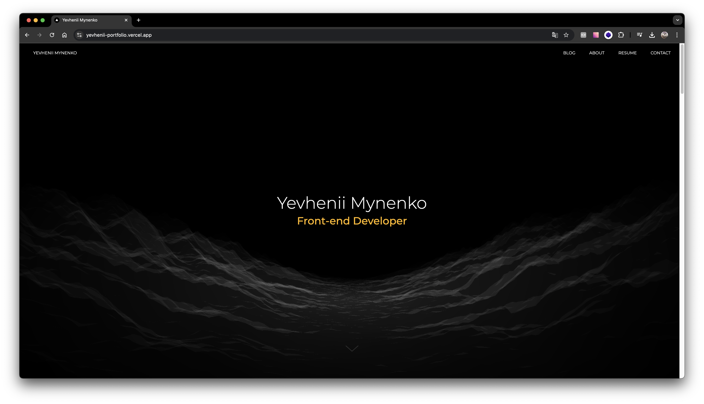

# Портфоліо Веб-сайт

## 📋 Огляд
Сучасний веб-сайт портфоліо, створений за допомогою Next.js, React Three Fiber та анімації GSAP. Проект демонструє інтерактивні 3D-елементи та плавні анімації для створення привабливого користувацького досвіду.

[Демо-версія](https://yevhenii-portfolio.vercel.app/)
[Github](https://github.com/Yevheniy2020/yevhenii-portfolio)






## 🌟 Особливості
- **Сучасний та адаптивний дизайн**: Оптимізований для всіх пристроїв та розмірів екрану
- **Інтерактивні 3D-елементи**: Вражаючі візуальні елементи, створені за допомогою Three.js
- **Плавні анімації**: Професійні анімації з використанням GSAP
- **Оптимізована продуктивність**: Швидке завантаження та взаємодія
- **Контактна форма**: Функціональна форма зворотного зв'язку

## 🛠️ Технологічний стек
- **Фреймворк**: Next.js 14.2.5
- **Основа**: React 18, React DOM 18
- **Графіка та анімації**: Three.js 0.167.0, React Three Fiber, React Three Drei, GSAP 3.12.5
- **Стилізація**: Tailwind CSS 3.4.1, PostCSS 8, tailwindcss-textshadow
- **Якість коду**: ESLint 8, eslint-config-next
- **Утиліти для бекенду**: Nodemailer 6.9.14
- **Збірка**: PostCSS

## 🚀 Встановлення та налаштування
Виконайте ці кроки для налаштування проєкту локально:

### Системні вимоги
- Сучасний багатоядерний процесор
- Мінімум 8 ГБ оперативної пам'яті (рекомендовано)
- 1 ГБ вільного місця
- Windows 10/11, macOS 10.15+, або Linux (Ubuntu 20.04+)

### Передумови
- Node.js 18.x LTS або вище
- npm (входить до складу Node.js) або yarn (рекомендується)
- Git

```bash
# Клонувати репозиторій
git clone [url-репозиторію]

# Перейти до директорії проєкту
cd portfolio-website

# Встановити залежності
yarn install
# або npm install

# Створити файл .env.local з необхідними змінними середовища
# NEXT_PUBLIC_API_URL=Backend API URL
# EMAIL_SERVICE=Email service provider
# EMAIL_USERNAME=Email service username
# EMAIL_PASSWORD=Email service password

# Запустити сервер розробки
yarn dev
# або npm run dev

# Збірка для виробництва
yarn build
# або npm run build

# Запустити виробничий сервер
yarn start
# або npm run start
```

## 📂 Структура проєкту
```
portfolio-website/
├── src/
│   ├── app/
│   │   ├── Компоненти сторінок
│   │   ├── Компоненти макетів
│   │   ├── Обробники маршрутів
│   │   └── API-ендпоінти
│   └── hooks/
│       ├── Хуки для анімацій
│       ├── Хуки для управління станом
│       └── Службові хуки
├── public/
│   ├── images/
│   ├── models/ (3D-моделі)
│   ├── fonts/
│   └── icons/
├── next.config.mjs
├── tailwind.config.js
├── postcss.config.mjs
├── jsconfig.json
└── .eslintrc.json
```

## 📱 Адаптивний дизайн
Портфоліо повністю адаптивне з наступними контрольними точками:
- sm: 640px
- md: 768px
- lg: 1024px
- xl: 1280px
- 2xl: 1536px

## 🧩 Ключові компоненти

### 3D-елементи
Інтерактивні 3D-моделі та анімації з використанням:
- Three.js
- React Three Fiber
- React Three Drei

### Анімації
Плавні та продуктивні анімації за допомогою GSAP:
- Переходи між сторінками
- Анімації при прокручуванні
- Ефекти при наведенні
- Анімації завантаження

### Контактна форма
Інтерактивна форма з функціональністю електронної пошти:
- Валідація формату електронної пошти
- Валідація обов'язкових полів
- Перевірка довжини повідомлення

## 🔄 Оптимізація продуктивності
- Оптимізація зображень за допомогою компонента Next.js Image
- Розділення коду та відкладене завантаження
- Рендеринг на стороні сервера для початкового завантаження сторінки
- Мініфікація CSS, JavaScript та HTML

## 🚀 Розгортання
Рекомендоване розгортання на Vercel. Альтернативи:
- Netlify
- AWS
- Digital Ocean

### Вимоги для розгортання
- Середовище хостингу Node.js
- Налаштування змінних середовища
- Можливість виконання команд збірки

## 📈 Метрики продуктивності
- First Contentful Paint: < 1.5с
- Time to Interactive: < 3.5с
- Largest Contentful Paint: < 2.5с

## 🔒 Безпека
- Змінні середовища для конфіденційних даних
- Реалізація політики CORS
- Захист від XSS
- Захист від CSRF
- Регулярні оновлення залежностей
- Налаштування заголовків безпеки
- Валідація та санітизація вводу

## 🔄 Усунення несправностей
### Поширені проблеми

**Сервер розробки не запускається**
- Перевірте сумісність версії Node.js
- Видаліть node_modules і package-lock.json
- Запустіть повторну установку npm

**3D-моделі не завантажуються**
- Перевірте, чи підтримуються формати файлів
- Перевірте шляхи до файлів моделей
- Переконайтеся, що Three.js правильно ініціалізовано
